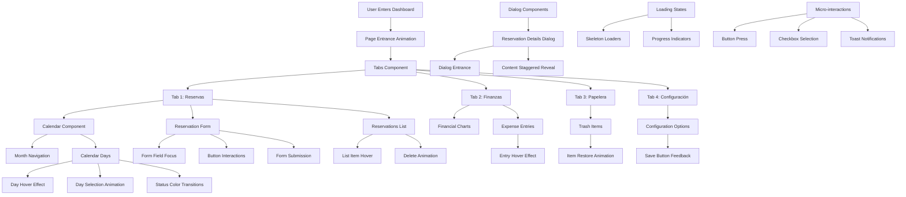
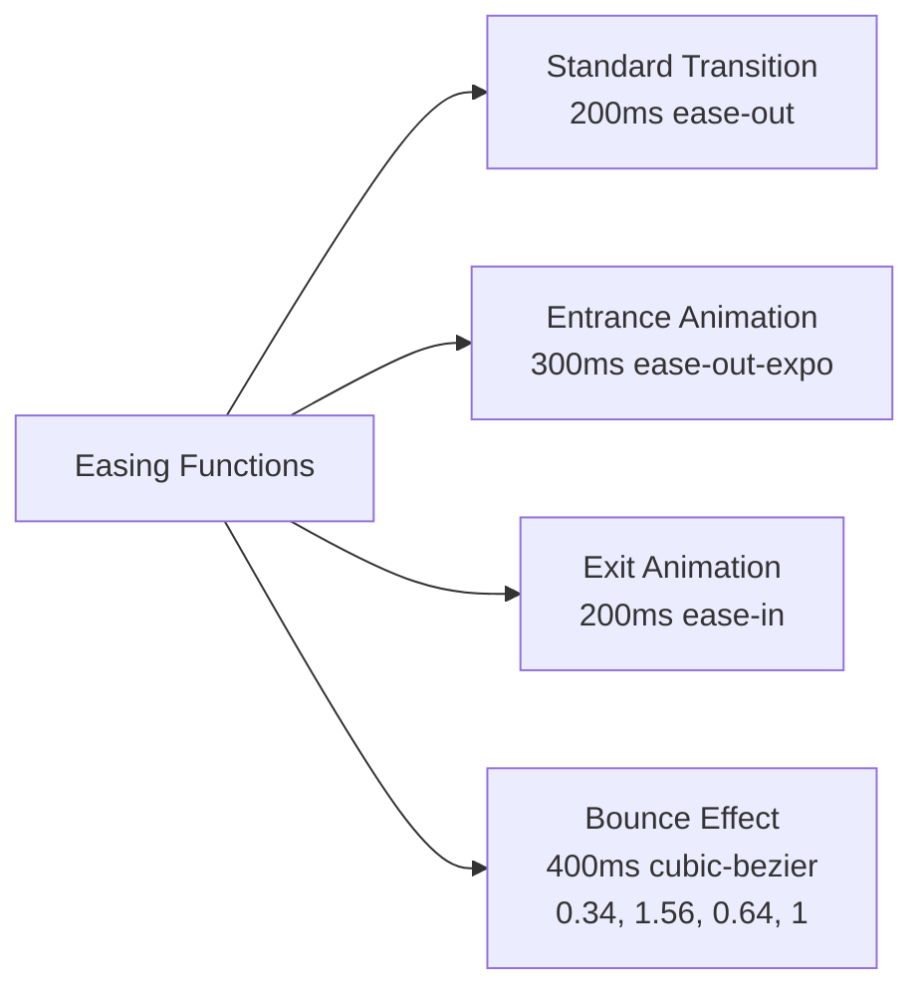

# Animation Flow Diagram for Atila Reservas



## Animation Timing and Easing



## Component Interaction Flow

```mermaid
sequenceDiagram
    participant User
    participant Calendar
    participant Form
    participant Dialog
    participant List
    
    User->>Calendar: Hover over day
    Calendar->>Calendar: Scale up 5% with transition
    User->>Calendar: Click on day
    Calendar->>Calendar: Pulse animation
    Calendar->>Form: Populate date field
    Form->>Form: Field highlight animation
    User->>Form: Fill form fields
    User->>Form: Submit form
    Form->>Form: Button loading spinner
    Form->>List: New reservation added
    List->>List: Staggered entrance animation
    User->>Calendar: Click on day with reservations
    Calendar->>Dialog: Open with scale-in animation
    Dialog->>Dialog: Content fade-in staggered